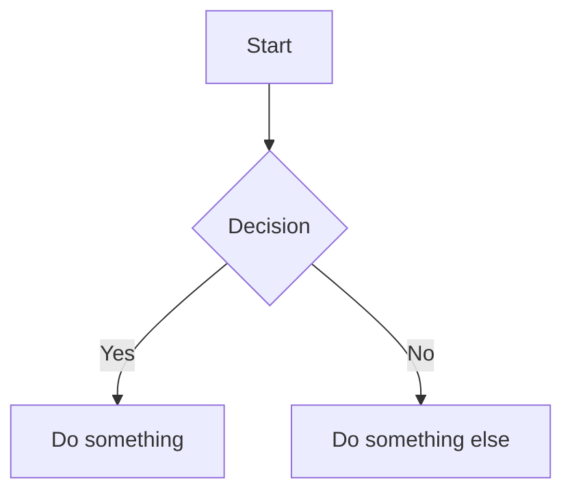

# Daedalus

A document generation pipeline for architectural proposal documents. Write content in Markdown, run `make build`, get a professional PDF — with cover page, table of contents, running headers, Mermaid diagrams, and bibliography.

Built on [Pandoc](https://pandoc.org/), [XeLaTeX](https://www.latex-project.org/), and [mermaid-filter](https://github.com/raghur/mermaid-filter).

---

## Quick Start

### Dependencies

| Tool | Purpose | Install |
|---|---|---|
| `pandoc` 3.1.12 | Markdown → PDF/HTML | [pandoc.org/installing](https://pandoc.org/installing.html) |
| `xelatex` | PDF rendering engine | `apt install texlive-xetex texlive-latex-extra` |
| `mermaid-filter` | Diagram rendering | `npm install -g mermaid-filter` |
| Chromium / Chrome | Required by mermaid-filter | `apt install chromium` / `brew install chromium` |

For mermaid-filter to find the browser:
```bash
export PUPPETEER_SKIP_CHROMIUM_DOWNLOAD=true
export PUPPETEER_EXECUTABLE_PATH=$(which chromium)  # or google-chrome-stable
```

Verify all dependencies are installed:
```bash
make check
```

### Build

```bash
make build       # generate project.pdf from the root example
make html        # generate project.html (no XeLaTeX required)
make clean       # remove project.pdf and project.html
make watch       # rebuild on file changes (requires fswatch or inotify-tools)
```

### Docker (no local dependencies required)

```bash
make docker-build   # build the image
make docker-run     # run the build inside the container
```

### VS Code Dev Container

Open this repository in VS Code with the Remote - Containers extension. The devcontainer uses the same Docker image as `make docker-run` — all dependencies are pre-installed and `make check` runs automatically on container start.

---

## Creating a New Proposal

```bash
make init NAME=my-proposal
```

This scaffolds `proposals/my-proposal/` from the templates directory:

```
proposals/my-proposal/
  config.yaml        # document metadata — edit this first
  project.bib        # bibliography
  images/            # drop logo.jpg or logo.png here for cover page logo
  markdown/
    01_Introduction.md
```

Build your proposal:
```bash
make build PROPOSAL=my-proposal
make html  PROPOSAL=my-proposal
```

---

## Project Structure

```
daedalus/
  config.yaml           # Root example metadata
  project.tex           # Shared LaTeX template (cover page, headers, styling)
  project.css           # CSS overrides for Mermaid diagram rendering
  project.bib           # Root example bibliography
  Makefile              # Build automation
  Dockerfile            # Containerised build environment
  markdown/             # Root example content
  images/               # Root example images
  templates/            # Starter files used by `make init`
    config.yaml
    project.bib
    markdown/
  proposals/            # Generated proposals (PDFs are gitignored)
  .devcontainer/        # VS Code devcontainer config
  .github/workflows/    # CI pipeline
```

---

## Authoring

### Document metadata (`config.yaml`)

```yaml
title: "My Architecture Proposal"
subtitle: "Technical Design Document"
author: "Jane Smith"
date: "April 2026"
```

For additional cover page fields, add `header-includes`:

```yaml
header-includes:
  - \def\docclient{Acme Corp}
  - \def\docversion{1.0}
  - \def\docclassification{Internal Use Only}
```

Margin and link colour settings are also in `config.yaml` — see the root example.

### Content files

Number Markdown files to control order:

```
markdown/
  01_Introduction.md
  02_Current_State.md
  03_Proposed_Solution.md
  04_Implementation.md
  05_Risks.md
  99_References.md
```

Each `#` heading starts a new page. `##` and `###` headings appear in the table of contents.

### Cover page logo

Drop `logo.jpg` or `logo.png` into the `images/` directory. It appears on the cover page automatically.

### Mermaid diagrams

````markdown

````

Supported types include flowcharts, sequence diagrams, ERDs, Gantt charts, and more.

### Bibliography

Add references to `project.bib`. Cite inline with `[@Key]` and list in the references section:

```markdown
[^ref1]: Reference description. [@BibKey]
```

---

## Customisation

### Cover page fields

`project.tex` defines the cover page layout. The following fields are supported:

| Source | Field | How to set |
|---|---|---|
| `config.yaml` | `title` | `title: "..."` |
| `config.yaml` | `subtitle` | `subtitle: "..."` |
| `config.yaml` | `author` | `author: "..."` |
| `config.yaml` | `date` | `date: "..."` |
| `header-includes` | Client name | `- \def\docclient{...}` |
| `header-includes` | Version | `- \def\docversion{...}` |
| `header-includes` | Classification | `- \def\docclassification{...}` |

### Margins

```yaml
geometry:
  - top=2cm
  - bottom=1.5cm
  - left=2cm
  - right=2cm
```

### Link colours

```yaml
colorlinks: true
linkcolor: blue
urlcolor: blue
filecolor: magenta
```

### Running headers and footers

Defined in `project.tex`. By default: document title (left), author (right), page number (centre footer). Edit the `\fancyhead` and `\fancyfoot` commands to customise.

---

## CI / Automated Validation

Every push triggers two GitHub Actions jobs:

**`build`** — installs pandoc, XeLaTeX, and mermaid-filter on a clean Ubuntu runner, builds `project.pdf`, then validates:
- PDF is non-empty and parseable
- Minimum page count (≥ 5)
- Expected section headings present in extracted text
- Uploads PDF as a downloadable artifact (retained 30 days)

**`docker`** — builds the Docker image (with layer caching) and runs a full build inside the container to validate the Dockerfile end-to-end.

Dependency downloads are cached (pandoc `.deb`, apt archives, npm) to speed up subsequent runs.
