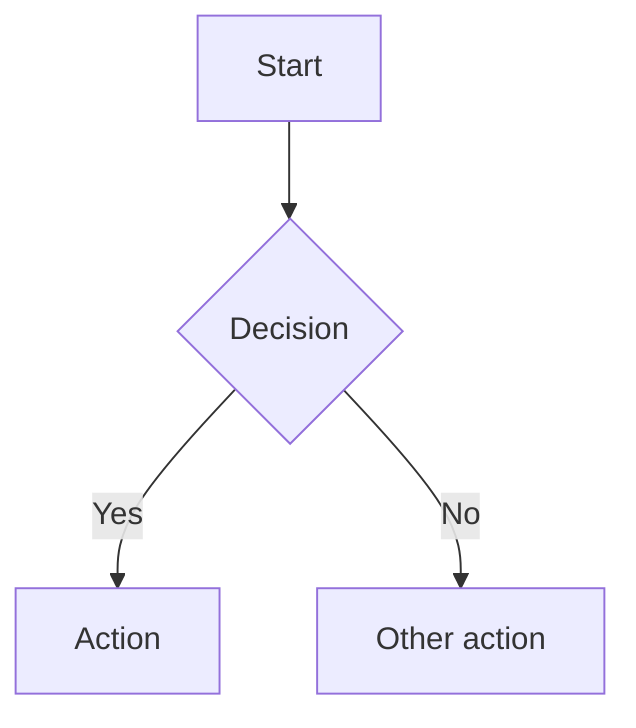

# Daedalus

[](https://github.com/adamdaw/daedalus/actions/workflows/build.yml)

A document generation pipeline for architectural proposal documents. Write content in Markdown, run `make build`, get a professional PDF — with cover page, table of contents, running headers, Mermaid diagrams, cross-references, and bibliography.

Built on [Pandoc](https://pandoc.org/), [XeLaTeX](https://www.latex-project.org/), [mermaid-filter](https://github.com/raghur/mermaid-filter), and [pandoc-crossref](https://github.com/lierdakil/pandoc-crossref).

---

## Quick Start

### Dependencies

| Tool | Purpose | Install |
|---|---|---|
| `pandoc` 3.1.13 | Markdown → PDF/HTML | [pandoc.org/installing](https://pandoc.org/installing.html) |
| `pandoc-crossref` 0.3.17.1 | Figure/table cross-references | [releases](https://github.com/lierdakil/pandoc-crossref/releases) |
| `xelatex` | PDF rendering engine | `apt install texlive-xetex texlive-latex-extra lmodern` |
| `mermaid-filter` | Diagram rendering | `npm install -g mermaid-filter` |
| Chromium / Chrome | Required by mermaid-filter | `apt install chromium` / `brew install chromium` |
| `markdownlint-cli` | Markdown linting (optional) | `npm install -g markdownlint-cli` |
| `codespell` | Spell checking (optional) | `pip install codespell` |

pandoc-crossref must be version-matched to pandoc. Download the Linux binary and place it on your `$PATH`:

```bash
wget https://github.com/lierdakil/pandoc-crossref/releases/download/v0.3.17.1/pandoc-crossref-Linux.tar.xz
tar -xf pandoc-crossref-Linux.tar.xz
sudo mv pandoc-crossref /usr/local/bin/
```

For mermaid-filter to find the browser:
```bash
export PUPPETEER_SKIP_CHROMIUM_DOWNLOAD=true
export PUPPETEER_EXECUTABLE_PATH=$(which chromium)
```

Verify all dependencies:
```bash
make check
```

### Build

```bash
make build        # generate project.pdf
make html         # generate project.html
make docx         # generate project.docx (Word)
make all          # generate both PDF and HTML
make clean        # remove generated output
make watch        # rebuild on file changes (requires fswatch or inotify-tools)
make open         # open the PDF in the system viewer
make help         # list all available targets
```

### Quality checks

```bash
make lint         # run markdownlint on content files
make spellcheck   # run codespell on content files
make validate     # run lint + spellcheck (without building)
make wordcount    # word count per file and total
make status       # show build state and word count for all proposals
```

### Draft mode

```bash
make build DRAFT=1   # adds a DRAFT watermark to every page
```

### Mermaid theme

```bash
make build MERMAID_THEME=dark     # dark theme
make build MERMAID_THEME=forest   # forest theme
```

Available themes: `default`, `dark`, `forest`, `neutral`. Defaults to `default`.

### Docker (no local dependencies required)

```bash
make docker-build   # build the image
make docker-run     # run the build inside the container
```

### VS Code Dev Container

Open this repository in VS Code with the Remote - Containers extension. The devcontainer uses the same Docker image — all dependencies are pre-installed.

### Pre-commit hooks

Install [pre-commit](https://pre-commit.com/) and run:

```bash
pre-commit install
```

This runs markdownlint and codespell automatically before every commit.

---

## Managing Proposals

### Create a new proposal

```bash
make init NAME=my-proposal
make init NAME=my-proposal TITLE="My Architecture Proposal" AUTHOR="Jane Smith"
# DATE defaults to the current month and year; override with DATE="January 2027"
make init NAME=my-proposal TITLE="..." AUTHOR="..." DATE="January 2027"
```

Scaffolds `proposals/my-proposal/` by copying from `templates/`. The root `markdown/` directory is a complete worked example used to demo the build — it is not a template and is not copied.

Each starter section contains placeholder headings and instructional comments. Delete and replace the content; the file names and numbering control document order.

```
proposals/my-proposal/
  config.yaml        # document metadata — edit this first
  project.bib        # bibliography
  images/            # drop logo.jpg, logo.png, or logo.pdf here
  markdown/
    01_Introduction_and_Goals.md
    02_Constraints.md
    03_Context_and_Scope.md
    04_Solution_Strategy.md
    05_Building_Block_View.md
    06_Runtime_View.md
    07_Deployment_View.md
    08_Crosscutting_Concepts.md
    09_Architecture_Decisions.md
    10_Quality_Requirements.md
    11_Risks_and_Technical_Debt.md
    99_References.md
```

### List proposals

```bash
make list
```

Prints all initialized proposals with their titles from `config.yaml`.

### Add a section

```bash
make new-section TITLE="Security Considerations" PROPOSAL=my-proposal
```

Creates the next numbered Markdown file in the proposal's `markdown/` directory.

### Build a proposal

```bash
make build PROPOSAL=my-proposal     # PDF
make html  PROPOSAL=my-proposal     # HTML
make docx  PROPOSAL=my-proposal     # Word (DOCX)
make all   PROPOSAL=my-proposal     # both PDF and HTML
make build PROPOSAL=my-proposal DRAFT=1  # draft watermark
make open  PROPOSAL=my-proposal     # open PDF in viewer
```

### Delete a proposal

```bash
make delete PROPOSAL=my-proposal CONFIRM=yes
```

Permanently removes `proposals/my-proposal/`. Requires `CONFIRM=yes` to prevent accidental deletion.

### Build all proposals

```bash
make build-all     # build PDF and HTML for every proposal in proposals/
make validate-all  # run lint + spellcheck for root example and every proposal
make clean-all     # remove generated output for root example and all proposals
```

### Archive for delivery

Once built, package the source and output into a timestamped zip:

```bash
make archive PROPOSAL=my-proposal
# Creates: proposals/my-proposal-20260414-143022.zip
```

---

## Project Structure

```
daedalus/
  config.yaml           # Root example metadata
  project.tex           # Shared LaTeX template (cover page, headers, fonts)
  project.css           # Mermaid CSS overrides
  project.bib           # Root example bibliography
  draft.tex             # Draft watermark (loaded when DRAFT=1)
  Makefile              # Build automation
  Dockerfile            # Containerised build environment
  .markdownlint.json    # Lint configuration
  .codespellrc          # Spell check configuration
  .pre-commit-config.yaml  # Pre-commit hook definitions
  markdown/             # Root example content (a complete sample proposal)
  images/               # Root example images
  templates/            # Skeleton copied into each new proposal by make init
  proposals/            # Your proposals (generated output is gitignored)
  .devcontainer/        # VS Code devcontainer config
  .github/workflows/    # CI/CD pipelines
```

---

## Authoring

### Document metadata (`config.yaml`)

```yaml
title: "My Architecture Proposal"
subtitle: "Technical Design Document"
# Multiple authors:
# author:
#   - "Jane Smith"
#   - "John Doe"
author: "Jane Smith"
date: "April 2026"

# Paper size and code highlighting
papersize: a4
highlight-style: tango

# TOC depth and section numbering
toc-depth: 3
numbersections: true

# Typography (fonts must be installed on the build system)
mainfont: "Georgia"
sansfont: "Helvetica Neue"
monofont: "Courier New"

# Executive summary — rendered before the TOC
abstract: |
  One-paragraph summary of the proposal.
```

For additional cover page fields:
```yaml
header-includes:
  - \def\docclient{Acme Corp}
  - \def\docversion{1.0}
  - \def\docclassification{Internal Use Only}
```

### Content files

Number Markdown files to control order. The default template follows the
[arc42](https://arc42.org) structure — a pragmatic, widely adopted standard for
software and systems architecture documentation:

```
markdown/
  01_Introduction_and_Goals.md     # requirements, quality goals, stakeholders
  02_Constraints.md                # technical, organisational, and conventional constraints
  03_Context_and_Scope.md          # system boundary, external systems, interfaces
  04_Solution_Strategy.md          # fundamental technology and structural decisions
  05_Building_Block_View.md        # static decomposition (C4 Container / Component)
  06_Runtime_View.md               # key scenarios and sequence diagrams
  07_Deployment_View.md            # infrastructure, environments, deployment process
  08_Crosscutting_Concepts.md      # security, logging, error handling, configuration
  09_Architecture_Decisions.md     # ADRs — the "why" behind key choices
  10_Quality_Requirements.md       # quality tree and measurable quality scenarios
  11_Risks_and_Technical_Debt.md   # known risks and tracked technical debt
  99_References.md                 # bibliography (populated by --citeproc)
```

Each `#` heading starts a new page. Sub-headings appear in the TOC up to `toc-depth`.
Add sections with `make new-section TITLE="Section Name" PROPOSAL=my-proposal`.

### Cover page logo

Drop `logo.jpg` or `logo.png` into `images/`. Appears on the cover page automatically.

### Mermaid diagrams

````markdown

````

Supported: flowcharts, sequence diagrams, ERDs, Gantt charts, and all other Mermaid types.

### Cross-references

Label figures and tables with `{#fig:id}` or `{#tbl:id}`, then cite them with `[@fig:id]` or `[@tbl:id]`:

```markdown
See [@tbl:decisions] for a summary of the architectural choices.

| Decision | Choice |
| --- | --- |
| Auth | JWT |

Table: Key decisions {#tbl:decisions}
```

pandoc-crossref automatically numbers all labelled figures and tables and resolves all citations.

### Bibliography

Add entries to `project.bib`. Cite with `[@Key]` inline:

```markdown
The strangler fig pattern is commonly used for legacy migrations [@S1].
```

---

## Customisation

### Cover page fields

| Source | Field | How to set |
|---|---|---|
| `config.yaml` | `title` | `title: "..."` |
| `config.yaml` | `subtitle` | `subtitle: "..."` |
| `config.yaml` | `author` | `author: "..."` |
| `config.yaml` | `date` | `date: "..."` |
| `header-includes` | Client | `- \def\docclient{...}` |
| `header-includes` | Version | `- \def\docversion{...}` |
| `header-includes` | Classification | `- \def\docclassification{...}` |

### Running headers and footers

Defined in `project.tex`. Default: document title (left), author (right), page number (centre footer). Edit `\fancyhead` and `\fancyfoot` to customise.

### Margins and colours

Configured in `config.yaml` via `geometry` and `colorlinks`/`linkcolor`/`urlcolor`.

### pandoc-crossref labels

Configure label prefixes and titles in `config.yaml`:

```yaml
figureTitle: "Figure"
tableTitle: "Table"
figPrefix: "fig."
tblPrefix: "tbl."
autoSectionLabels: true
```

---

## CI/CD

### `build.yml` — runs on every push

1. Installs pandoc, pandoc-crossref, XeLaTeX, mermaid-filter, markdownlint, codespell
2. Lints all markdown files
3. Spell-checks all markdown files
4. Builds `project.pdf` and validates structure (page count, section headings)
5. Builds `project.html` and validates it is non-empty
6. Uploads PDF and HTML as downloadable artifacts (30-day retention)
7. Builds and tests the Docker image end-to-end (full PDF validation)

### `proposals.yml` — runs when `proposals/**` changes

Detects which proposal directories were modified in the push, then builds only those proposals in parallel (matrix strategy). Uploads PDF and HTML for each as artifacts.

### `release.yml` — runs on `v*` tags

Builds the root example PDF and HTML and attaches both to the GitHub Release as downloadable assets. Tag a release with `git tag v1.0 && git push origin v1.0`.

---

## Dependency caching

All CI jobs cache:
- The pandoc `.deb` installer (keyed by pandoc version)
- The pandoc-crossref `.tar.xz` binary (keyed by crossref version)
- apt package archives (keyed by workflow file hash)
- npm cache (keyed by workflow file hash)

---

## Troubleshooting

### `Error: mermaid-filter not found`

Install mermaid-filter and ensure the browser path is set:

```bash
npm install -g mermaid-filter
export PUPPETEER_SKIP_CHROMIUM_DOWNLOAD=true
export PUPPETEER_EXECUTABLE_PATH=$(which chromium || which google-chrome)
```

### `Error: pandoc-crossref not found`

Download the binary matching your pandoc version and place it on `$PATH`:

```bash
wget https://github.com/lierdakil/pandoc-crossref/releases/download/v0.3.17.1/pandoc-crossref-Linux.tar.xz
tar -xf pandoc-crossref-Linux.tar.xz
sudo mv pandoc-crossref /usr/local/bin/
```

pandoc-crossref must be version-matched to pandoc. Run `make check` to verify both versions together.

### `Warning: expected pandoc 3.1.13, got X.Y.Z`

The build will still proceed, but cross-references or other features may behave differently. Install the pinned version from [pandoc releases](https://github.com/jgm/pandoc/releases/tag/3.1.13) or use Docker to get a guaranteed-correct environment.

### Mermaid diagrams render as blank boxes

The `PUPPETEER_EXECUTABLE_PATH` environment variable must point to a real Chrome or Chromium binary. Confirm with:

```bash
echo $PUPPETEER_EXECUTABLE_PATH
$PUPPETEER_EXECUTABLE_PATH --version
```

If running as root (e.g., in Docker), Chrome requires `--no-sandbox`. The Dockerfile wraps the binary automatically; for local root environments, set:

```bash
export MERMAID_FILTER_PUPPETEER_ARGS='{"args":["--no-sandbox"]}'
```

### `xelatex not found`

Install the required TeX packages:

```bash
# Debian / Ubuntu
sudo apt-get install texlive-xetex texlive-fonts-recommended texlive-latex-extra lmodern

# macOS
brew install --cask mactex
```

Alternatively, use Docker — all dependencies are pre-installed:

```bash
make docker-run
```
