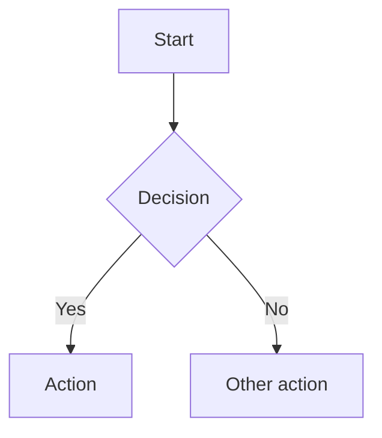

# Daedalus

A document generation pipeline for architectural proposal documents. Write content in Markdown, run `make build`, get a professional PDF — with cover page, table of contents, running headers, Mermaid diagrams, and bibliography.

Built on [Pandoc](https://pandoc.org/), [XeLaTeX](https://www.latex-project.org/), and [mermaid-filter](https://github.com/raghur/mermaid-filter).

---

## Quick Start

### Dependencies

| Tool | Purpose | Install |
|---|---|---|
| `pandoc` 3.1.12 | Markdown → PDF/HTML | [pandoc.org/installing](https://pandoc.org/installing.html) |
| `xelatex` | PDF rendering engine | `apt install texlive-xetex texlive-latex-extra lmodern` |
| `mermaid-filter` | Diagram rendering | `npm install -g mermaid-filter` |
| Chromium / Chrome | Required by mermaid-filter | `apt install chromium` / `brew install chromium` |
| `markdownlint-cli` | Markdown linting (optional) | `npm install -g markdownlint-cli` |
| `codespell` | Spell checking (optional) | `pip install codespell` |

For mermaid-filter to find the browser:
```bash
export PUPPETEER_SKIP_CHROMIUM_DOWNLOAD=true
export PUPPETEER_EXECUTABLE_PATH=$(which chromium)
```

Verify all dependencies:
```bash
make check
```

### Build

```bash
make build        # generate project.pdf
make html         # generate project.html
make all          # generate both PDF and HTML
make clean        # remove generated output
make watch        # rebuild on file changes (requires fswatch or inotify-tools)
```

### Quality checks

```bash
make lint         # run markdownlint on content files
make spellcheck   # run codespell on content files
make wordcount    # word count per file and total
```

### Draft mode

```bash
make build DRAFT=1   # adds a DRAFT watermark to every page
```

### Docker (no local dependencies required)

```bash
make docker-build   # build the image
make docker-run     # run the build inside the container
```

### VS Code Dev Container

Open this repository in VS Code with the Remote - Containers extension. The devcontainer uses the same Docker image — all dependencies are pre-installed.

---

## Managing Proposals

### Create a new proposal

```bash
make init NAME=my-proposal
```

Scaffolds `proposals/my-proposal/` from the `templates/` directory:

```
proposals/my-proposal/
  config.yaml        # document metadata — edit this first
  project.bib        # bibliography
  images/            # drop logo.jpg or logo.png here
  markdown/
    01_Introduction.md
```

### Build a proposal

```bash
make build PROPOSAL=my-proposal     # PDF
make html  PROPOSAL=my-proposal     # HTML
make all   PROPOSAL=my-proposal     # both
make build PROPOSAL=my-proposal DRAFT=1  # draft watermark
```

### Archive for delivery

Once built, package the source and output into a timestamped zip:

```bash
make archive PROPOSAL=my-proposal
# Creates: proposals/my-proposal-20260414-143022.zip
```

---

## Project Structure

```
daedalus/
  config.yaml           # Root example metadata
  project.tex           # Shared LaTeX template (cover page, headers, fonts)
  project.css           # Mermaid CSS overrides
  project.bib           # Root example bibliography
  draft.tex             # Draft watermark (loaded when DRAFT=1)
  Makefile              # Build automation
  Dockerfile            # Containerised build environment
  .markdownlint.json    # Lint configuration
  .codespellrc          # Spell check configuration
  markdown/             # Root example content
  images/               # Root example images
  templates/            # Starter files used by make init
  proposals/            # Your proposals (generated output is gitignored)
  .devcontainer/        # VS Code devcontainer config
  .github/workflows/    # CI/CD pipelines
```

---

## Authoring

### Document metadata (`config.yaml`)

```yaml
title: "My Architecture Proposal"
subtitle: "Technical Design Document"
author: "Jane Smith"
date: "April 2026"

# TOC depth and section numbering
toc-depth: 3
numbersections: true

# Typography (fonts must be installed on the build system)
mainfont: "Georgia"
sansfont: "Helvetica Neue"
monofont: "Courier New"

# Executive summary — rendered before the TOC
abstract: |
  One-paragraph summary of the proposal.
```

For additional cover page fields:
```yaml
header-includes:
  - \def\docclient{Acme Corp}
  - \def\docversion{1.0}
  - \def\docclassification{Internal Use Only}
```

### Content files

Number Markdown files to control order:

```
markdown/
  01_Introduction.md
  02_Current_State.md
  03_Proposed_Solution.md
  04_Implementation.md
  05_Risks.md
  99_References.md
```

Each `#` heading starts a new page. Sub-headings appear in the TOC up to `toc-depth`.

### Cover page logo

Drop `logo.jpg` or `logo.png` into `images/`. Appears on the cover page automatically.

### Mermaid diagrams

````markdown

````

Supported: flowcharts, sequence diagrams, ERDs, Gantt charts, and all other Mermaid types.

### Bibliography

Add entries to `project.bib`. Cite with `[@Key]` inline:

```markdown
The strangler fig pattern is commonly used for legacy migrations [@S1].
```

---

## Customisation

### Cover page fields

| Source | Field | How to set |
|---|---|---|
| `config.yaml` | `title` | `title: "..."` |
| `config.yaml` | `subtitle` | `subtitle: "..."` |
| `config.yaml` | `author` | `author: "..."` |
| `config.yaml` | `date` | `date: "..."` |
| `header-includes` | Client | `- \def\docclient{...}` |
| `header-includes` | Version | `- \def\docversion{...}` |
| `header-includes` | Classification | `- \def\docclassification{...}` |

### Running headers and footers

Defined in `project.tex`. Default: document title (left), author (right), page number (centre footer). Edit `\fancyhead` and `\fancyfoot` to customise.

### Margins and colours

Configured in `config.yaml` via `geometry` and `colorlinks`/`linkcolor`/`urlcolor`.

---

## CI/CD

### `build.yml` — runs on every push

1. Installs pandoc, XeLaTeX, mermaid-filter, markdownlint, codespell
2. Lints all markdown files
3. Spell-checks all markdown files
4. Builds `project.pdf`
5. Validates PDF structure (page count, section headings)
6. Uploads PDF as a downloadable artifact (30-day retention)
7. Builds and tests the Docker image end-to-end

### `proposals.yml` — runs when `proposals/**` changes

Detects which proposal directories were modified in the push, then builds only those proposals in parallel (matrix strategy). Uploads PDF and HTML for each as artifacts.

### `release.yml` — runs on `v*` tags

Builds the root example PDF and attaches it to the GitHub Release as a downloadable asset. Tag a release with `git tag v1.0 && git push origin v1.0`.

---

## Dependency caching

All CI jobs cache:
- The pandoc `.deb` installer (keyed by version)
- apt package archives (keyed by workflow file hash)
- npm cache (keyed by workflow file hash)
