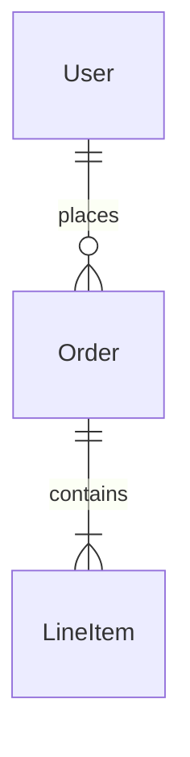

# Daedalus

A document generation pipeline for architectural proposal documents. Write content in Markdown, run `make build`, get a professional PDF — with table of contents, Mermaid diagrams, bibliography, and a cover page.

Built on [Pandoc](https://pandoc.org/), [XeLaTeX](https://www.latex-project.org/), and [mermaid-filter](https://github.com/raghur/mermaid-filter).

---

## Quick Start

### Dependencies

| Tool | Purpose | Install |
|---|---|---|
| `pandoc` (3.x) | Markdown → PDF conversion | [pandoc.org/installing](https://pandoc.org/installing.html) |
| `xelatex` | PDF rendering engine | `apt install texlive-xetex texlive-latex-extra` |
| `mermaid-filter` | Mermaid diagram rendering | `npm install -g mermaid-filter` |
| `chromium` | Required by mermaid-filter | `apt install chromium` / `brew install chromium` |

For mermaid-filter to find Chromium, set:
```bash
export PUPPETEER_SKIP_CHROMIUM_DOWNLOAD=true
export PUPPETEER_EXECUTABLE_PATH=$(which chromium)  # or chromium-browser
```

### Build

```bash
make build       # generate project.pdf
make clean       # remove project.pdf
make check       # verify all dependencies are installed
make watch       # rebuild on file changes (requires fswatch or inotify-tools)
```

### Docker (no local dependencies required)

```bash
make docker-build   # build the image
make docker-run     # run the build inside the container
```

---

## Project Structure

```
daedalus/
  config.yaml         # Document metadata (title, author, date)
  markdown/           # Content — numbered files, processed in order
    01_Introduction.md
    02_Problem_Description.md
    99_References.md
  images/             # Logos and static images
    logo.jpg          # Cover page logo (optional — drop in and it appears automatically)
  project.tex         # LaTeX customisation: cover page, margins, fonts, hyperlinks
  project.css         # CSS overrides for Mermaid diagram rendering
  project.bib         # BibTeX bibliography (can be exported from Zotero)
  Makefile            # Build automation
  Dockerfile          # Containerised build environment
```

---

## Authoring

### Document metadata

Edit `config.yaml` to set the document title, author, and date:

```yaml
title: "My Architecture Proposal"
author: "Jane Smith"
date: "April 2026"
```

These appear on the cover page and in the PDF metadata.

### Content files

Add Markdown files to `markdown/`, prefixed with a number to control order:

```
markdown/
  01_Introduction.md
  02_Current_State.md
  03_Proposed_Solution.md
  04_Timeline.md
  99_References.md
```

Each top-level `#` heading becomes a section in the table of contents and starts on a new page.

### Logo

Drop `logo.jpg` or `logo.png` into `images/`. It will appear automatically on the cover page — no configuration needed.

### Mermaid diagrams

Use fenced code blocks with the `mermaid` language tag:

````markdown

````

Any diagram type supported by Mermaid works: flowcharts, sequence diagrams, ERDs, Gantt charts, etc.

### Bibliography

Add references to `project.bib` in BibTeX format (Zotero can export this directly). Cite them inline with `[@key]` and list them in your references section with footnote-style links:

```markdown
- Item one [^ref1]

[^ref1]: Description of item one. [@BibKey]
```

---

## CI / Automated Validation

Every push triggers a GitHub Actions workflow that:

1. Installs pandoc, XeLaTeX, and mermaid-filter on a clean Ubuntu runner
2. Builds `project.pdf`
3. Validates the output:
   - PDF file is non-empty
   - PDF is parseable (valid structure)
   - Minimum page count is met
   - Expected section headings are present in the extracted text
4. Uploads the built PDF as a downloadable workflow artifact (retained 30 days)

Build status reflects whether the document compiles and contains the expected structure — no manual inspection required for a passing build.

---

## Customisation

### Margins and layout

Edit `project.tex`. The geometry settings are at the top:

```latex
\usepackage[top=2cm, bottom=1.5cm, left=2cm, right=2cm]{geometry}
```

### Hyperlink colours

Also in `project.tex`:

```latex
\hypersetup{
    linkcolor=blue,
    urlcolor=RoyalBlue,
}
```

### Mermaid diagram appearance

Edit `project.css` to override Mermaid's default rendering styles.

### Cover page

The cover page is defined in `project.tex` as a `\maketitle` override. Modify it to add fields like client name, version, or a custom layout.
