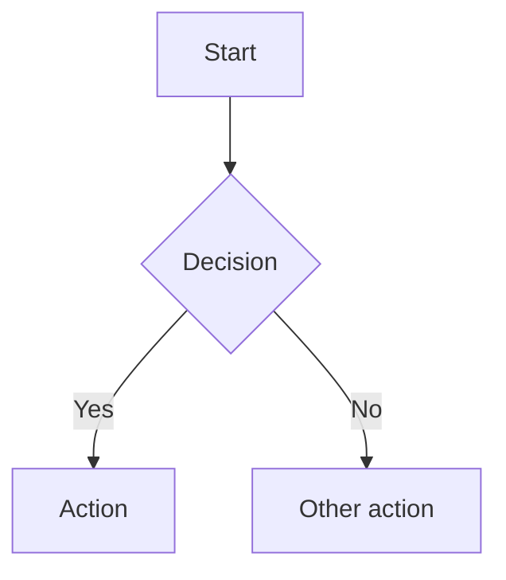

# Daedalus

[](https://github.com/adamdaw/daedalus/actions/workflows/build.yml?query=branch%3Amaster)

An architecture documentation pipeline with structured requirements elicitation. Write in Markdown, run `make all`, get professional PDF, HTML, and DOCX — with cover page, table of contents, Mermaid diagrams, cross-references, and bibliography. No AI required.

Daedalus guides you from blank proposal to finished document through two phases: **requirements gathering** ([ISO/IEC/IEEE 29148:2018](https://www.iso.org/standard/72089.html)) and **architecture elicitation** ([arc42](https://arc42.org) default template, with [C4 Model](https://c4model.com) diagrams). Interactive bash scripts walk you through each section at the terminal; [Claude Code](https://docs.anthropic.com/en/docs/claude-code) commands provide AI-assisted enrichment for teams that use it.

Built on [Pandoc](https://pandoc.org/), [XeLaTeX](https://www.latex-project.org/), [pandoc-ext/diagram](https://github.com/pandoc-ext/diagram) + [@mermaid-js/mermaid-cli](https://github.com/mermaid-js/mermaid-cli), and [pandoc-crossref](https://github.com/lierdakil/pandoc-crossref). The pipeline is framework-agnostic — arc42 is the current default, with additional templates [planned](docs/ENHANCEMENTS.md).

---

## Standards & Practices

Daedalus follows recognised industry standards throughout — in the document template, the diagram notation,
the decision record format, the quality model, and across the entire build pipeline. Every significant
implementation decision is documented with its rationale and authoritative reference in
[`docs/pipeline-decisions.md`](docs/pipeline-decisions.md).

### Document & Architecture

| Standard | Reference | Applied in |
|---|---|---|
| **arc42** | [arc42.org](https://arc42.org) | Document template structure — all 11 sections |
| **C4 Model** | [c4model.com](https://c4model.com) | Context, Container, and Deployment diagrams (Sections 3, 5, 7) |
| **Architecture Decision Records** | [adr.github.io](https://adr.github.io) | Section 9 ADR format (Nygard, 2011) |
| **ISO/IEC 25010** | [iso25000.com/iso-25010](https://iso25000.com/en/iso-25000-standards/iso-25010) | Software quality model — Section 10 quality scenarios, `/req-03` non-functional requirements |
| **ISO/IEC/IEEE 29148:2018** | [iso.org/standard/72089](https://www.iso.org/standard/72089.html) | Requirements specification structure — `requirements.md` template, `/req-*` commands |

### Pipeline & Tooling

| Standard | Reference | Applied in |
|---|---|---|
| **Conventional Commits** | [conventionalcommits.org](https://www.conventionalcommits.org) | Commit message format (`feat:`, `fix:`, `chore:`, `docs:`); enforced by pre-commit |
| **Semantic Versioning** | [semver.org](https://semver.org) | Release tags (`v1.0.0`) trigger `release.yml` |
| **OCI Image Spec** | [opencontainers.org — annotations](https://github.com/opencontainers/image-spec/blob/main/annotations.md) | Docker image labels: title, description, source, licenses |
| **OpenSSF Supply Chain Best Practices** | [best.openssf.org](https://best.openssf.org) | SHA-256 binary download verification (pandoc, pandoc-crossref) in Dockerfile and CI |
| **OpenSSF Scorecard** | [securityscorecards.dev](https://securityscorecards.dev) | SHA-pinned Actions, Dependabot, CodeQL, Trivy scanning, least-privilege permissions |
| **SLSA** | [slsa.dev](https://slsa.dev) | SLSA provenance attestation on Docker images pushed to GHCR |
| **EditorConfig** | [editorconfig.org](https://editorconfig.org) | Consistent formatting across editors and IDEs (`.editorconfig`) |
| **pre-commit framework** | [pre-commit.com](https://pre-commit.com) | Automated quality gates: linting, spellcheck, Conventional Commits |
| **GNU Make conventions** | [GNU Make manual](https://www.gnu.org/software/make/manual/make.html) | `.DEFAULT_GOAL := help`; self-documenting targets via `##` comments |
| **PEP 668** | [peps.python.org/pep-0668](https://peps.python.org/pep-0668/) | Python tools installed in an isolated venv, not system Python |
| **CommonMark** | [spec.commonmark.org](https://spec.commonmark.org/0.31.2/) | Trailing whitespace preserved in `.md` files (hard line break spec §2.2) |
| **GitHub community health** | [docs.github.com — community health](https://docs.github.com/en/communities/setting-up-your-project-for-healthy-contributions) | `CONTRIBUTING.md`, `SECURITY.md` |

---

## Quick Start

### Dependencies

| Tool | Purpose | Install |
|---|---|---|
| `pandoc` 3.1.13 | Markdown → PDF/HTML | [pandoc.org/installing](https://pandoc.org/installing.html) |
| `pandoc-crossref` 0.3.17.1 | Figure/table cross-references | [releases](https://github.com/lierdakil/pandoc-crossref/releases) |
| `xelatex` | PDF rendering engine | `apt install texlive-xetex texlive-latex-extra lmodern` |
| `@mermaid-js/mermaid-cli` 11.12.0 | Diagram rendering (mmdc) | `npm install -g @mermaid-js/mermaid-cli@11.12.0` |
| Chromium / Chrome | Required by mmdc (Puppeteer) | `apt install chromium` / `brew install chromium` |
| `markdownlint-cli` 0.48.0 | Markdown linting (optional) | `npm install -g markdownlint-cli@0.48.0` |
| `codespell` | Spell checking (optional) | `pip install --constraint requirements-dev.txt codespell` |
| Node.js >= 22 | Required by npm tools | [nodejs.org](https://nodejs.org) |

Development tools (for testing and coverage — not required for document generation):

| Tool | Purpose | Install |
|---|---|---|
| `bats` | Shell script testing | `apt install bats` / [bats-core](https://github.com/bats-core/bats-core) |
| `shellcheck` | Shell script linting | `apt install shellcheck` / [shellcheck.net](https://www.shellcheck.net) |
| `pytest` + `pytest-cov` | Python testing + coverage | `pip install --constraint requirements-dev.txt pytest pytest-cov` |
| `bashcov` | Bash coverage analysis | `gem install bashcov simplecov-cobertura` / [Gemfile](Gemfile) |

pandoc-crossref must be version-matched to pandoc. Download the Linux binary and place it on your `$PATH`:

```bash
curl -fsSL -o pandoc-crossref-Linux.tar.xz \
  https://github.com/lierdakil/pandoc-crossref/releases/download/v0.3.17.1/pandoc-crossref-Linux.tar.xz
tar -xf pandoc-crossref-Linux.tar.xz
sudo mv pandoc-crossref /usr/local/bin/
```

For mmdc to find the browser and the pandoc-ext/diagram filter to invoke it:
```bash
export PUPPETEER_SKIP_CHROMIUM_DOWNLOAD=true
export PUPPETEER_EXECUTABLE_PATH=$(which chromium)
# MERMAID_BIN points filters/diagram.lua at the mmdc binary (or a wrapper script)
export MERMAID_BIN=$(which mmdc)
```

Verify all dependencies:
```bash
make check
```

### Build

```bash
make build        # generate project.pdf
make html         # generate project.html
make docx         # generate project.docx (Word)
make all          # generate PDF, HTML, and DOCX
make clean        # remove generated output
make watch        # rebuild on file changes (requires fswatch or inotify-tools)
make open         # open the PDF in the system viewer
make help         # list all available targets
```

### Quality checks

```bash
make lint         # run markdownlint on content files
make spellcheck   # run codespell on content files
make shellcheck   # lint shell scripts with ShellCheck
make validate     # run lint + spellcheck + shellcheck (without building)
make wordcount    # word count per file and total
make status       # show build state and word count for all proposals
make version      # print installed versions of all build tools
make progress     # show elicitation completion dashboard
make ready        # validate artifacts are ready for spec authoring
```

### Testing

```bash
make test-scripts  # run bats unit tests for shell scripts (95 tests)
make test-python   # run Python unit tests with 90% coverage gate
make test-lua      # run Lua filter integration tests
make test-all      # run all tests (bats + Python + Lua)
make coverage      # run bash test coverage analysis (requires Ruby + bashcov)
```

The test suite comprises 113 tests across three languages:
- **95 bats tests** — shell scripts and Makefile targets (`test/scripts/*.bats`)
- **12 pytest tests** — Python JSONC validation (`test/python/`)
- **6 Lua integration tests** — pandoc diagram filter (`test/lua/`)

Coverage gates enforce 90% minimum line coverage for project-owned code:
- **Bash:** [bashcov](https://github.com/infertux/bashcov) + [SimpleCov](https://github.com/simplecov-ruby/simplecov) (`.simplecov` config)
- **Python:** [pytest-cov](https://pytest-cov.readthedocs.io) with `--cov-fail-under=90`
- **Lua:** Excluded from line-level gate — `filters/diagram.lua` is [vendored third-party code](https://github.com/pandoc-ext/diagram) tested via integration tests

### Draft mode

```bash
make build DRAFT=1   # adds a DRAFT watermark to every page
```

### Mermaid theme

```bash
make build MERMAID_THEME=dark     # dark theme
make build MERMAID_THEME=forest   # forest theme
```

Available themes: `default`, `dark`, `forest`, `neutral`. Defaults to `default`.

### Docker (no local dependencies required)

```bash
make docker-build       # build the image locally
make docker-run         # run the build inside the locally-built container
make docker-pull-run    # pull the pre-built image from GHCR and run the build
```

The pre-built image (`ghcr.io/adamdaw/daedalus:latest`) is published to GitHub Container
Registry on every push to `master`. Using it skips the ~3-minute local Docker build.

### VS Code Dev Container

Open this repository in VS Code with the Remote - Containers extension. The devcontainer uses the same Docker image — all dependencies are pre-installed.

### Pre-commit hooks

Install [pre-commit](https://pre-commit.com/) and run:

```bash
pre-commit install
```

`default_install_hook_types: [pre-commit, commit-msg]` is declared in `.pre-commit-config.yaml`,
so a single `pre-commit install` installs both hook types — no extra flags needed.

This enforces quality gates automatically on every commit:
- **File hygiene** — trailing whitespace, end-of-file newlines, valid YAML/JSON/JSONC, no merge conflict markers
- **Markdown linting** — markdownlint on content files
- **Spell checking** — codespell on content files
- **Conventional Commits** — commit message format validated on every commit (`feat:`, `fix:`, `chore:`, `docs:`, etc.)

---

## Managing Proposals

### Create a new proposal

```bash
make init NAME=my-proposal
make init NAME=my-proposal TITLE="My Architecture Proposal" AUTHOR="Jane Smith"
# DATE defaults to the current month and year; override with DATE="January 2027"
make init NAME=my-proposal TITLE="..." AUTHOR="..." DATE="January 2027"
```

Scaffolds `proposals/my-proposal/` by copying from `templates/`. The root `markdown/` directory is a complete worked example used to demo the build — it is not a template and is not copied.

Each starter section contains placeholder headings and instructional comments. Delete and replace the content; the file names and numbering control document order.

```
proposals/my-proposal/
  config.yaml          # document metadata — edit this first
  project.bib          # bibliography
  brief.md             # architecture elicitation skeleton (arc42)
  requirements.md      # requirements specification skeleton (ISO 29148)
  images/              # drop logo.jpg, logo.png, or logo.pdf here
  markdown/
    01_Introduction_and_Goals.md
    02_Constraints.md
    03_Context_and_Scope.md
    04_Solution_Strategy.md
    05_Building_Block_View.md
    06_Runtime_View.md
    07_Deployment_View.md
    08_Crosscutting_Concepts.md
    09_Architecture_Decisions.md
    10_Quality_Requirements.md
    11_Risks_and_Technical_Debt.md
    99_References.md
```

### List proposals

```bash
make list
```

Prints all initialized proposals with their titles from `config.yaml`.

### Add a section

```bash
make new-section TITLE="Security Considerations" PROPOSAL=my-proposal
```

Creates the next numbered Markdown file in the proposal's `markdown/` directory.

### Build a proposal

```bash
make build PROPOSAL=my-proposal     # PDF
make html  PROPOSAL=my-proposal     # HTML
make docx  PROPOSAL=my-proposal     # Word (DOCX)
make all   PROPOSAL=my-proposal     # PDF, HTML, and DOCX
make build PROPOSAL=my-proposal DRAFT=1  # draft watermark
make open  PROPOSAL=my-proposal     # open PDF in viewer
```

### Delete a proposal

```bash
make delete PROPOSAL=my-proposal CONFIRM=yes
```

Permanently removes `proposals/my-proposal/`. Requires `CONFIRM=yes` to prevent accidental deletion.

### Build all proposals

```bash
make build-all     # build PDF, HTML, and DOCX for every proposal in proposals/
make validate-all  # run lint + spellcheck for root example and every proposal
make clean-all     # remove generated output for root example and all proposals
```

### Archive for delivery

Once built, package the source and output into a timestamped zip:

```bash
make archive PROPOSAL=my-proposal
# Creates: proposals/my-proposal-20260414-143022.zip
```

---

## Authoring Workflow

Daedalus provides a structured path from blank proposal to finished document, aligned with
[ISO/IEC/IEEE 29148:2018](https://www.iso.org/standard/72089.html) for requirements engineering
and [arc42](https://arc42.org) for architecture documentation. Two paths are available — one
AI-assisted (using [Claude Code](https://docs.anthropic.com/en/docs/claude-code)), one fully
manual. Both produce the same structured artifacts.

### AI-assisted (Claude Code)

Sixteen slash commands guide interactive elicitation — five for requirements (`/req-01` through
`/req-05`) and eleven for architecture (`/gather-01` through `/gather-11`). Each command is
**resumable**: if a section already has content, it asks whether to add, update, or replace.

```bash
make init NAME=my-proposal
cd proposals/my-proposal

# Option A: Guided start-to-finish (recommended for new users)
/start-proposal

# Option B: Step-by-step with progress tracking
/elicit                        # shows progress, runs next step automatically

# Option C: Individual commands
/req-01 through /req-05        # → requirements.md
/gather-01 through /gather-11  # → brief.md (cross-references requirements.md)
```

The full VSDD (Verified Software Design Document) prompt roster is in `prompts/`. See
`prompts/05-elicitation.md` for the elicitation methodology and `prompts/06-req-author.md`
for an alternative synthesis path (provide raw material — meeting notes, emails, briefs — and
it produces a structured `requirements.md`, flagging gaps and contradictions).

### Non-AI fallback

Interactive bash scripts provide the same structured elicitation without requiring Claude Code
or any AI service. Answers flow through the same artifact format (`requirements.md` →
`brief.md` → arc42 markdown).

```bash
make init NAME=my-proposal

make gather-requirements PROPOSAL=my-proposal  # interactive requirements → requirements.md
make gather-brief PROPOSAL=my-proposal         # interactive architecture → brief.md
make progress PROPOSAL=my-proposal             # show completion dashboard
make ready PROPOSAL=my-proposal                # validate cross-document consistency
make assemble PROPOSAL=my-proposal             # assemble arc42 markdown from artifacts

make all PROPOSAL=my-proposal                  # → PDF + HTML + DOCX
```

The non-AI path is also used in CI — `make test-elicitation` exercises the full pipeline
end-to-end using fixture data in `test/fixtures/`.

---

## Project Structure

```
daedalus/
  config.yaml              # Root example metadata
  project.tex              # Shared LaTeX template (cover page, headers, fonts)
  project.css              # HTML stylesheet (light + dark mode, print)
  project.bib              # Root example bibliography
  draft.tex                # Draft watermark (loaded when DRAFT=1)
  Makefile                 # Build automation (~40 targets)
  Dockerfile               # Containerised build environment (Ubuntu 24.04)
  package.json             # Node.js tool version pins (source of truth for npm tools)
  requirements-dev.txt     # Python tool pins (source of truth for codespell)
  filters/
    diagram.lua            # Vendored pandoc-ext/diagram Lua filter (v1.2.0)
  markdown/                # Root example content (a complete sample proposal)
  images/                  # Root example images
  templates/               # Skeleton copied into each new proposal by make init
    config.yaml            # Document metadata template
    project.bib            # Bibliography template
    brief.md               # Architecture elicitation skeleton (arc42)
    requirements.md        # Requirements specification skeleton (ISO 29148)
    markdown/              # 11 empty arc42 sections + 99_References
  proposals/               # Your proposals (generated output is gitignored)
  prompts/                 # VSDD agent prompt files
    00-workflow.md         # Architect — session start, phase mapping, handoff protocol
    01-arch-spec-author.md # Spec Author — write or revise arc42 document
    02-adversary-arch.md   # Adversary — full adversarial review of all 11 sections
    03-adr-author.md       # ADR Author — write or audit Architecture Decision Records
    04-feedback-triage.md  # Architect — triage adversarial findings
    05-elicitation.md      # Reference — arc42 elicitation methodology
    06-req-author.md       # Requirements Author — synthesise raw material into requirements.md
  docs/                    # VSDD knowledge base
    mem-1-project-context.md   # Authority hierarchy, agent roles, phase gates
    mem-2-vsdd-reference.md    # VSDD pipeline, convergence signal, anti-patterns
    mem-3-pipeline-standards.md # Section standards, diagram conventions
    mem-4-process-lessons.md   # Build lessons, documentation lessons, constraints
    pipeline-decisions.md      # Every significant decision with rationale and reference
  scripts/                 # Elicitation and validation automation
    gather-requirements.sh # Non-AI requirements elicitation (ISO 29148)
    gather-brief.sh        # Non-AI architecture elicitation (arc42)
    assemble.sh            # Assemble arc42 markdown from elicitation artifacts
    validate-artifacts.sh  # Validate requirements.md and brief.md structure
    progress.sh            # Elicitation progress dashboard
    validate-jsonc.py      # JSONC validation for devcontainer.json
  test/
    scripts/             # bats unit tests (95 tests across 8 files)
    python/              # pytest tests for validate-jsonc.py (12 tests)
    lua/                 # Lua filter integration tests (6 tests)
    fixtures/            # CI fixture data (requirements, brief, JSONC)
  .claude/commands/        # Claude Code slash commands (/start-proposal, /elicit, /req-01–05, /gather-01–11)
  .devcontainer/           # VS Code Dev Container config
  .github/
    workflows/             # CI/CD pipelines (build, proposals, release, codeql)
    dependabot.yml         # Weekly version bump PRs (Actions, Docker, npm, pip)
    CODEOWNERS             # Auto-assigns reviewer on all PRs
    ISSUE_TEMPLATE/        # Bug report and feature request templates
    pull_request_template.md
  .markdownlint.yaml       # Lint configuration (YAML enables inline comments)
  .codespellrc             # Spell check configuration
  .pre-commit-config.yaml  # Pre-commit hook definitions
  .editorconfig            # Consistent formatting across editors
  Gemfile                  # Ruby dependencies for coverage tooling (bashcov)
  .simplecov               # bashcov/SimpleCov coverage configuration (90% gate)
```

---

## Authoring

### Document metadata (`config.yaml`)

```yaml
title: "My Architecture Proposal"
subtitle: "Technical Design Document"
# Multiple authors:
# author:
#   - "Jane Smith"
#   - "John Doe"
author: "Jane Smith"
date: "April 2026"

# Paper size and code highlighting
papersize: a4
highlight-style: tango

# TOC depth and section numbering
toc-depth: 3
numbersections: true

# Typography (fonts must be installed on the build system)
mainfont: "Georgia"
sansfont: "Helvetica Neue"
monofont: "Courier New"

# Executive summary — rendered before the TOC
abstract: |
  One-paragraph summary of the proposal.
```

For additional cover page fields:
```yaml
header-includes:
  - \def\docclient{Acme Corp}
  - \def\docversion{1.0}
  - \def\docclassification{Internal Use Only}
```

### Content files

Number Markdown files to control order. The default template follows the
[arc42](https://arc42.org) structure — a pragmatic, widely adopted standard for
software and systems architecture documentation:

```
markdown/
  01_Introduction_and_Goals.md     # requirements, quality goals, stakeholders
  02_Constraints.md                # technical, organisational, and conventional constraints
  03_Context_and_Scope.md          # system boundary, external systems, interfaces
  04_Solution_Strategy.md          # fundamental technology and structural decisions
  05_Building_Block_View.md        # static decomposition (C4 Container / Component)
  06_Runtime_View.md               # key scenarios and sequence diagrams
  07_Deployment_View.md            # infrastructure, environments, deployment process
  08_Crosscutting_Concepts.md      # security, logging, error handling, configuration
  09_Architecture_Decisions.md     # ADRs — the "why" behind key choices
  10_Quality_Requirements.md       # quality tree and measurable quality scenarios
  11_Risks_and_Technical_Debt.md   # known risks and tracked technical debt
  99_References.md                 # bibliography (populated by --citeproc)
```

Each `#` heading starts a new page. Sub-headings appear in the TOC up to `toc-depth`.
Add sections with `make new-section TITLE="Section Name" PROPOSAL=my-proposal`.

### Cover page logo

Drop `logo.jpg` or `logo.png` into `images/`. Appears on the cover page automatically.

### Mermaid diagrams

````markdown

````

Supported: flowcharts, sequence diagrams, ERDs, Gantt charts, and all other Mermaid types.

### Cross-references

Label figures and tables with `{#fig:id}` or `{#tbl:id}`, then cite them with `[@fig:id]` or `[@tbl:id]`:

```markdown
See [@tbl:decisions] for a summary of the architectural choices.

| Decision | Choice |
| --- | --- |
| Auth | JWT |

Table: Key decisions {#tbl:decisions}
```

pandoc-crossref automatically numbers all labelled figures and tables and resolves all citations.

### Bibliography

Add entries to `project.bib`. Cite with `[@Key]` inline:

```markdown
The strangler fig pattern is commonly used for legacy migrations [@S1].
```

---

## Customisation

### Cover page fields

| Source | Field | How to set |
|---|---|---|
| `config.yaml` | `title` | `title: "..."` |
| `config.yaml` | `subtitle` | `subtitle: "..."` |
| `config.yaml` | `author` | `author: "..."` |
| `config.yaml` | `date` | `date: "..."` |
| `header-includes` | Client | `- \def\docclient{...}` |
| `header-includes` | Version | `- \def\docversion{...}` |
| `header-includes` | Classification | `- \def\docclassification{...}` |

### Running headers and footers

Defined in `project.tex`. Default: document title (left), author (right), page number (centre footer). Edit `\fancyhead` and `\fancyfoot` to customise.

### Margins and colours

Configured in `config.yaml` via `geometry` and `colorlinks`/`linkcolor`/`urlcolor`.

### pandoc-crossref labels

Configure label prefixes and titles in `config.yaml`:

```yaml
figureTitle: "Figure"
tableTitle: "Table"
figPrefix: "fig."
tblPrefix: "tbl."
autoSectionLabels: true
```

---

## CI/CD

### `build.yml` — runs on every push, PR, or manual trigger

1. Installs pandoc, pandoc-crossref, XeLaTeX, @mermaid-js/mermaid-cli, markdownlint, codespell
2. Lints all markdown files
3. Spell-checks all markdown files
4. Builds `project.pdf` and validates structure (page count, arc42 section headings)
5. Builds `project.html` and validates it is non-empty
6. Builds `project.docx` and validates it is non-empty
7. Uploads PDF, HTML, and DOCX as downloadable artifacts (30-day retention)
8. Tests the non-AI elicitation pipeline end-to-end using fixture data (`make test-elicitation`)
9. Builds and validates the Docker image end-to-end, then pushes to GHCR

Can also be triggered manually from the GitHub Actions UI (`workflow_dispatch`).

### `proposals.yml` — runs when `proposals/**` changes, or manually

Detects which proposal directories were modified in the push, then builds and validates
only those proposals in parallel (matrix strategy). Each proposal is checked against
all arc42 section headings. Uploads PDF, HTML, and DOCX for each as artifacts.

Supports manual trigger: optionally specify a single `proposal` name to rebuild, or
leave empty to rebuild all proposals.

### `release.yml` — runs on `v*` tags

Lints and spell-checks, builds the root example PDF, HTML, and DOCX, validates all
artifacts, then attaches them to the GitHub Release. Tag a release with:

```bash
git tag v1.0 && git push origin v1.0
```

### `codeql.yml` — runs on every push, PR, and weekly cron

[CodeQL](https://codeql.github.com/) static analysis targeting GitHub Actions YAML for
script injection vulnerabilities. Uses `continue-on-error` for SARIF upload (requires
GitHub Advanced Security on private repos).

---

## Dependency caching

All CI jobs cache:
- The pandoc `.deb` installer (keyed by pandoc version)
- The pandoc-crossref `.tar.xz` binary (keyed by crossref version)
- apt package archives (stable key `apt-ubuntu-24.04-texlive-v1`, shared across all workflows; bump the suffix if packages change)
- npm global cache (keyed by tool versions, e.g. `npm-mermaid-cli-11.12.0-markdownlint-0.48.0`; shared across all workflows)

---

## Troubleshooting

### `Error: mmdc not found`

Install `@mermaid-js/mermaid-cli` and ensure the browser path and `MERMAID_BIN` are set:

```bash
npm install -g @mermaid-js/mermaid-cli@11.12.0
export PUPPETEER_SKIP_CHROMIUM_DOWNLOAD=true
export PUPPETEER_EXECUTABLE_PATH=$(which chromium || which google-chrome)
export MERMAID_BIN=$(which mmdc)
```

### `Error: pandoc-crossref not found`

Download the binary matching your pandoc version and place it on `$PATH`:

```bash
curl -fsSL -o pandoc-crossref-Linux.tar.xz \
  https://github.com/lierdakil/pandoc-crossref/releases/download/v0.3.17.1/pandoc-crossref-Linux.tar.xz
tar -xf pandoc-crossref-Linux.tar.xz
sudo mv pandoc-crossref /usr/local/bin/
```

pandoc-crossref must be version-matched to pandoc. Run `make check` to verify both versions together.

### `Warning: expected pandoc 3.1.13, got X.Y.Z`

The build will still proceed, but cross-references or other features may behave differently. Install the pinned version from [pandoc releases](https://github.com/jgm/pandoc/releases/tag/3.1.13) or use Docker to get a guaranteed-correct environment.

### Mermaid diagrams render as blank boxes

`PUPPETEER_EXECUTABLE_PATH` must point to a real Chrome or Chromium binary, and `MERMAID_BIN`
must point to the `mmdc` binary (or a wrapper script). Confirm with:

```bash
echo $PUPPETEER_EXECUTABLE_PATH
$PUPPETEER_EXECUTABLE_PATH --version
echo $MERMAID_BIN
$MERMAID_BIN --version
```

If running as root (e.g., in Docker), Chrome requires `--no-sandbox`. The Dockerfile handles
this automatically via a Chrome wrapper script and a puppeteer config at `/etc/mmdc-puppeteer.json`.

For local root environments or Ubuntu 24.04+ (AppArmor sandbox restriction), create a puppeteer
config file and use a wrapper script as `MERMAID_BIN`:

```bash
echo '{"executablePath":"'$(which google-chrome)'","args":["--no-sandbox","--disable-setuid-sandbox"]}' \
  > /tmp/mmdc-puppeteer.json
printf '#!/bin/sh\nexec mmdc --puppeteerConfigFile /tmp/mmdc-puppeteer.json --theme "${MERMAID_THEME:-default}" "$@"\n' \
  > /tmp/mmdc-pandoc && chmod +x /tmp/mmdc-pandoc
export MERMAID_BIN=/tmp/mmdc-pandoc
```

### `xelatex not found`

Install the required TeX packages:

```bash
# Debian / Ubuntu
sudo apt-get install texlive-xetex texlive-fonts-recommended texlive-latex-extra lmodern

# macOS
brew install --cask mactex
```

Alternatively, use Docker — all dependencies are pre-installed:

```bash
make docker-run
```

---

## Roadmap

Daedalus is designed to be framework-agnostic — arc42 is the current default, not a
permanent commitment. Planned enhancements include support for additional documentation
frameworks (TOGAF, 4+1 View, ISO 42010), requirements standards (BABOK, Volere),
prioritisation methods (WSJF, Kano, RICE), diagram engines (PlantUML, GraphViz, D2),
and output formats (web via MkDocs, AsciiDoc input).

See [`docs/ENHANCEMENTS.md`](docs/ENHANCEMENTS.md) for the full roadmap and
[open issues](https://github.com/adamdaw/daedalus/issues) for tracked work.
