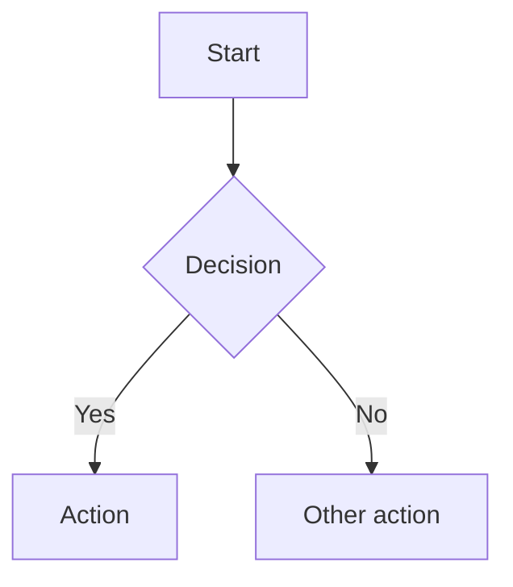

# Authoring

This guide covers the elicitation workflow, managing proposals, and writing content.
For installation and build commands, see [getting-started.md](getting-started.md).

---

## Authoring Workflow

Daedalus provides a structured path from blank proposal to finished document, aligned with
[ISO/IEC/IEEE 29148:2018](https://www.iso.org/standard/72089.html) for requirements engineering
and [arc42](https://arc42.org) for architecture documentation. Two paths are available — one
AI-assisted (using [Claude Code](https://docs.anthropic.com/en/docs/claude-code)), one fully
manual. Both produce the same structured artifacts.

### AI-assisted (Claude Code)

Sixteen slash commands guide interactive elicitation — five for requirements (`/req-01` through
`/req-05`) and eleven for architecture (`/gather-01` through `/gather-11`). Each command is
**resumable**: if a section already has content, it asks whether to add, update, or replace.

```bash
make init NAME=my-proposal
cd proposals/my-proposal

# Option A: Guided start-to-finish (recommended for new users)
/start-proposal

# Option B: Step-by-step with progress tracking
/elicit                        # shows progress, runs next step automatically

# Option C: Individual commands
/req-01 through /req-05        # → requirements.md
/gather-01 through /gather-11  # → brief.md (cross-references requirements.md)
```

The full VSDD (Verified Software Design Document) prompt roster is in `prompts/`. See
`prompts/05-elicitation.md` for the elicitation methodology and `prompts/06-req-author.md`
for an alternative synthesis path (provide raw material — meeting notes, emails, briefs — and
it produces a structured `requirements.md`, flagging gaps and contradictions).

### Non-AI fallback

Interactive bash scripts provide the same structured elicitation without requiring Claude Code
or any AI service. Answers flow through the same artifact format (`requirements.md` →
`brief.md` → arc42 markdown).

```bash
make init NAME=my-proposal

make gather-requirements PROPOSAL=my-proposal  # interactive requirements → requirements.md
make gather-brief PROPOSAL=my-proposal         # interactive architecture → brief.md
make progress PROPOSAL=my-proposal             # show completion dashboard
make ready PROPOSAL=my-proposal                # validate cross-document consistency
make assemble PROPOSAL=my-proposal             # assemble arc42 markdown from artifacts

make all PROPOSAL=my-proposal                  # → PDF + HTML + DOCX
```

The non-AI path is also used in CI — `make test-elicitation` exercises the full pipeline
end-to-end using fixture data in `test/fixtures/`.

---

## Managing Proposals

### Create a new proposal

```bash
make init NAME=my-proposal
make init NAME=my-proposal TITLE="My Architecture Proposal" AUTHOR="Jane Smith"
# DATE defaults to the current month and year; override with DATE="January 2027"
make init NAME=my-proposal TITLE="..." AUTHOR="..." DATE="January 2027"
```

Scaffolds `proposals/my-proposal/` by copying from `templates/`. The root `markdown/` directory is a complete worked example used to demo the build — it is not a template and is not copied.

Each starter section contains placeholder headings and instructional comments. Delete and replace the content; the file names and numbering control document order.

```
proposals/my-proposal/
  config.yaml          # document metadata — edit this first
  project.bib          # bibliography
  brief.md             # architecture elicitation skeleton (arc42)
  requirements.md      # requirements specification skeleton (ISO 29148)
  images/              # drop logo.jpg, logo.png, or logo.pdf here
  markdown/
    01_Introduction_and_Goals.md
    02_Constraints.md
    03_Context_and_Scope.md
    04_Solution_Strategy.md
    05_Building_Block_View.md
    06_Runtime_View.md
    07_Deployment_View.md
    08_Crosscutting_Concepts.md
    09_Architecture_Decisions.md
    10_Quality_Requirements.md
    11_Risks_and_Technical_Debt.md
    99_References.md
```

### List proposals

```bash
make list
```

Prints all initialized proposals with their titles from `config.yaml`.

### Add a section

```bash
make new-section TITLE="Security Considerations" PROPOSAL=my-proposal
```

Creates the next numbered Markdown file in the proposal's `markdown/` directory.

### Build a proposal

```bash
make build PROPOSAL=my-proposal     # PDF
make html  PROPOSAL=my-proposal     # HTML
make docx  PROPOSAL=my-proposal     # Word (DOCX)
make all   PROPOSAL=my-proposal     # PDF, HTML, and DOCX
make build PROPOSAL=my-proposal DRAFT=1  # draft watermark
make open  PROPOSAL=my-proposal     # open PDF in viewer
```

### Delete a proposal

```bash
make delete PROPOSAL=my-proposal CONFIRM=yes
```

Permanently removes `proposals/my-proposal/`. Requires `CONFIRM=yes` to prevent accidental deletion.

### Build all proposals

```bash
make build-all     # build PDF, HTML, and DOCX for every proposal in proposals/
make validate-all  # run lint + spellcheck for root example and every proposal
make clean-all     # remove generated output for root example and all proposals
```

### Archive for delivery

Once built, package the source and output into a timestamped zip:

```bash
make archive PROPOSAL=my-proposal
# Creates: proposals/my-proposal-20260414-143022.zip
```

---

## Writing Content

### Document metadata (`config.yaml`)

```yaml
title: "My Architecture Proposal"
subtitle: "Technical Design Document"
# Multiple authors:
# author:
#   - "Jane Smith"
#   - "John Doe"
author: "Jane Smith"
date: "April 2026"

# Paper size and code highlighting
papersize: a4
highlight-style: tango

# TOC depth and section numbering
toc-depth: 3
numbersections: true

# Typography (fonts must be installed on the build system)
mainfont: "Georgia"
sansfont: "Helvetica Neue"
monofont: "Courier New"

# Executive summary — rendered before the TOC
abstract: |
  One-paragraph summary of the proposal.
```

For additional cover page fields:

```yaml
header-includes:
  - \def\docclient{Acme Corp}
  - \def\docversion{1.0}
  - \def\docclassification{Internal Use Only}
```

### Content files

Number Markdown files to control order. The default template follows the
[arc42](https://arc42.org) structure — a pragmatic, widely adopted standard for
software and systems architecture documentation:

```
markdown/
  01_Introduction_and_Goals.md     # requirements, quality goals, stakeholders
  02_Constraints.md                # technical, organisational, and conventional constraints
  03_Context_and_Scope.md          # system boundary, external systems, interfaces
  04_Solution_Strategy.md          # fundamental technology and structural decisions
  05_Building_Block_View.md        # static decomposition (C4 Container / Component)
  06_Runtime_View.md               # key scenarios and sequence diagrams
  07_Deployment_View.md            # infrastructure, environments, deployment process
  08_Crosscutting_Concepts.md      # security, logging, error handling, configuration
  09_Architecture_Decisions.md     # ADRs — the "why" behind key choices
  10_Quality_Requirements.md       # quality tree and measurable quality scenarios
  11_Risks_and_Technical_Debt.md   # known risks and tracked technical debt
  99_References.md                 # bibliography (populated by --citeproc)
```

Each `#` heading starts a new page. Sub-headings appear in the TOC up to `toc-depth`.
Add sections with `make new-section TITLE="Section Name" PROPOSAL=my-proposal`.

### Cover page logo

Drop `logo.jpg` or `logo.png` into `images/`. Appears on the cover page automatically.

### Mermaid diagrams

````markdown

````

Supported: flowcharts, sequence diagrams, ERDs, Gantt charts, and all other Mermaid types.

### Cross-references

Label figures and tables with `{#fig:id}` or `{#tbl:id}`, then cite them with `[@fig:id]` or `[@tbl:id]`:

```markdown
See [@tbl:decisions] for a summary of the architectural choices.

| Decision | Choice |
| --- | --- |
| Auth | JWT |

Table: Key decisions {#tbl:decisions}
```

pandoc-crossref automatically numbers all labelled figures and tables and resolves all citations.

### Bibliography

Add entries to `project.bib`. Cite with `[@Key]` inline:

```markdown
The strangler fig pattern is commonly used for legacy migrations [@S1].
```

---

## Customisation

### Cover page fields

| Source | Field | How to set |
|---|---|---|
| `config.yaml` | `title` | `title: "..."` |
| `config.yaml` | `subtitle` | `subtitle: "..."` |
| `config.yaml` | `author` | `author: "..."` |
| `config.yaml` | `date` | `date: "..."` |
| `header-includes` | Client | `- \def\docclient{...}` |
| `header-includes` | Version | `- \def\docversion{...}` |
| `header-includes` | Classification | `- \def\docclassification{...}` |

### Running headers and footers

Defined in `project.tex`. Default: document title (left), author (right), page number (centre footer). Edit `\fancyhead` and `\fancyfoot` to customise.

### Margins and colours

Configured in `config.yaml` via `geometry` and `colorlinks`/`linkcolor`/`urlcolor`.

### pandoc-crossref labels

Configure label prefixes and titles in `config.yaml`:

```yaml
figureTitle: "Figure"
tableTitle: "Table"
figPrefix: "fig."
tblPrefix: "tbl."
autoSectionLabels: true
```
