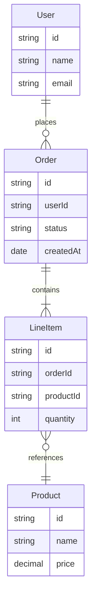
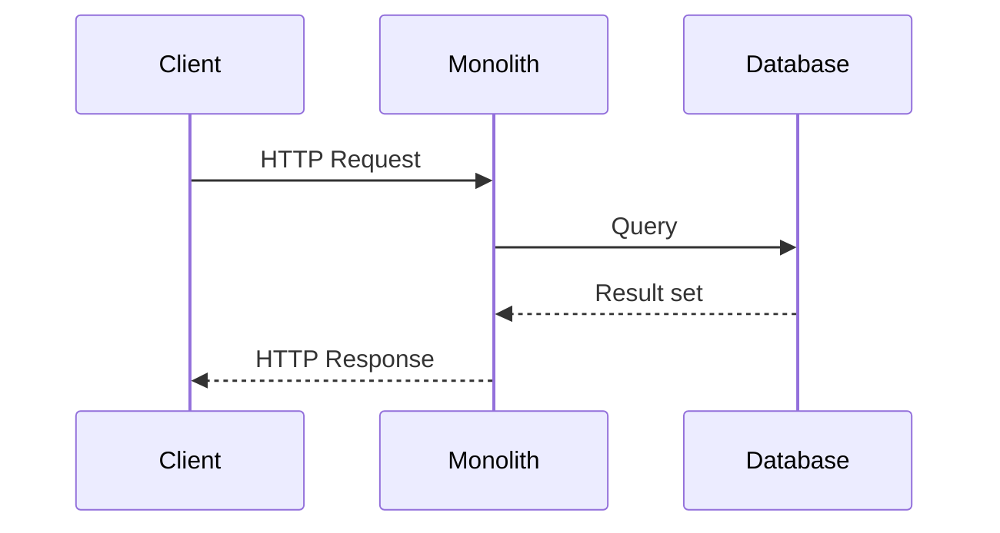

# Current State

The existing system is a single-tier monolithic application deployed on-premises. All business logic, data access, and presentation concerns are bundled into one deployable unit.

## Pain Points

- **Deployment risk** — any change requires a full application restart, causing downtime
- **Scalability** — the entire application must be scaled even when only one component is under load
- **Development velocity** — teams cannot deploy independently, creating release bottlenecks

## Current Data Model

The following diagram shows the core entities and their relationships in the existing system.

## Current Request Flow

