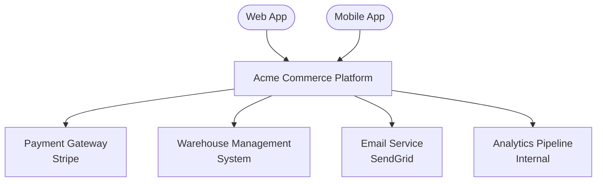

# Context and Scope

## Business Context

The Acme Commerce platform sits at the centre of the order fulfillment pipeline. It accepts
orders from web and mobile clients, processes payments through a third-party provider, and
coordinates fulfillment with the warehouse management system. Transactional emails are
dispatched via an external email service provider.

| Neighbour | Description | Interface Direction |
| --- | --- | --- |
| Web App | React SPA operated by Acme frontend team | inbound |
| Mobile App | iOS/Android apps operated by Acme mobile team | inbound |
| Payment Gateway | Stripe; handles card authorisation and capture | outbound |
| Warehouse Management System | Legacy on-premises WMS; receives pick-and-pack instructions | outbound |
| Email Service | SendGrid; dispatches transactional emails | outbound |
| Analytics Pipeline | Internal Kafka-based pipeline; consumes order events | outbound |

## Technical Context

| Interface | Protocol / Format | Notes |
| --- | --- | --- |
| Client → Platform | HTTPS / REST + JSON | TLS 1.2 minimum; JWT bearer auth |
| Platform → Payment Gateway | HTTPS / REST + JSON | Stripe SDK wraps the API |
| Platform → WMS | HTTPS / REST + XML | Legacy WMS requires XML; an adapter service translates |
| Platform → Email | HTTPS / REST + JSON | SendGrid Events API |
| Platform → Analytics | Kafka / Avro | Schema registry enforced |
