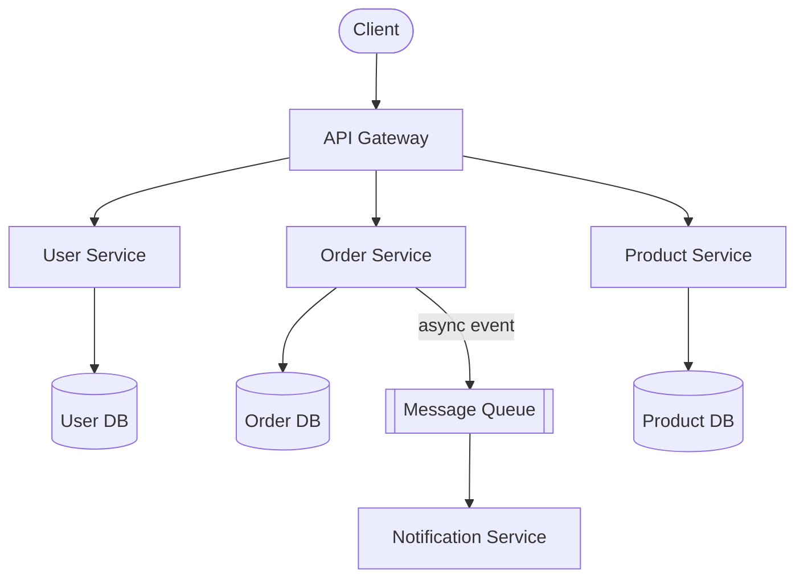

# Proposed Solution

The proposed architecture decomposes the monolith into three focused services behind an API gateway. Each service owns its data store and communicates via well-defined contracts.

## Service Architecture

## Service Responsibilities

### API Gateway

- Route and authenticate incoming requests
- Rate limiting and request validation
- Aggregate responses where needed

### User Service

- Account creation and authentication
- Profile management
- Session handling

### Order Service

- Order lifecycle management
- Inventory reservation
- Publishes `order.placed` and `order.fulfilled` events

### Product Service

- Product catalogue and pricing
- Stock level management

## Key Design Decisions

| Decision | Choice | Rationale |
| --- | --- | --- |
| Inter-service communication | REST over HTTPS | Simplicity; teams already familiar with HTTP |
| Async messaging | Message queue | Decouples order processing from notification delivery |
| Data isolation | One DB per service | Prevents cross-service coupling at the data layer |
| Authentication | JWT at gateway | Stateless; services trust validated tokens |
