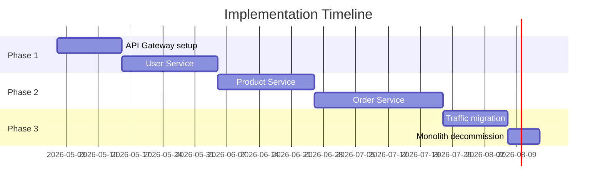

# Implementation Plan

The migration is staged across three phases to minimise risk. The monolith remains in production throughout until each service is proven in production.

## Phases

## Phase 1 — Foundation

Deploy the API gateway and extract the User Service. Route authentication traffic to the new service while the monolith handles all other requests.

**Exit criteria:** User Service handles 100% of auth traffic with no increase in error rate.

## Phase 2 — Core Services

Extract Product and Order services. Run each in parallel with the monolith using a strangler-fig pattern, progressively shifting traffic.

**Exit criteria:** All three services handle production traffic; monolith receives no requests.

## Phase 3 — Cut-Over

Complete traffic migration, validate observability coverage, and decommission the monolith.

**Exit criteria:** Monolith infrastructure terminated; all services monitored and alerting.
