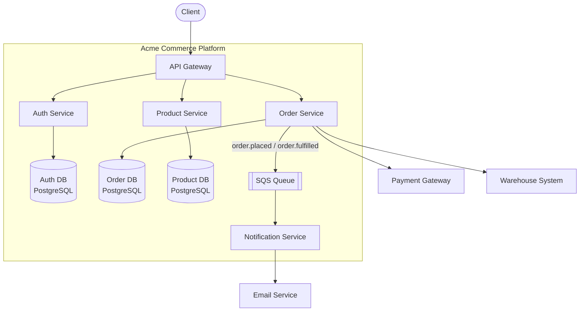
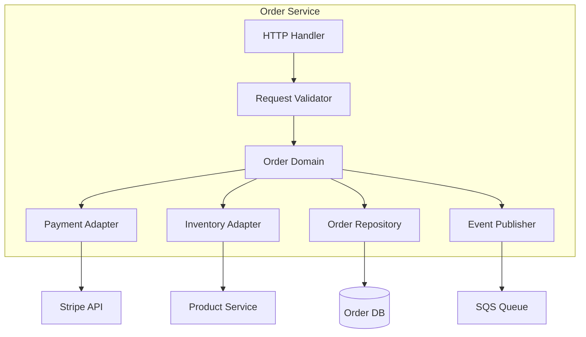

# Building Block View

## Level 1: Container Overview

The platform is decomposed into four services behind an API gateway. Each service owns its
data store. The order service publishes events to a shared message queue consumed by the
notification service. Key design decisions are summarised in [@tbl:design-decisions].

| Building Block | Responsibility |
| --- | --- |
| API Gateway | Routes requests; enforces TLS; validates JWT on protected routes |
| Auth Service | Issues and validates JWTs; manages user accounts and sessions |
| Order Service | Order lifecycle; payment authorisation; publishes order events |
| Product Service | Product catalogue, pricing, and stock level management |
| Notification Service | Consumes order events; dispatches transactional emails |

| Decision | Choice | Rationale |
| --- | --- | --- |
| Inter-service communication | REST over HTTPS | Familiar to all teams; adequate for request-response patterns |
| Async messaging | Amazon SQS | Managed; at-least-once delivery; dead-letter queue for failed messages |
| Data isolation | One PostgreSQL DB per service | Prevents coupling at the data layer; each team owns its schema |
| Authentication | JWT issued by Auth Service | Stateless; services validate tokens without a synchronous auth call |

Table: Key design decisions {#tbl:design-decisions}

## Level 2: Order Service Internals

The order service handles the most complex domain logic and warrants a deeper view.

| Component | Responsibility |
| --- | --- |
| HTTP Handler | Parses and routes HTTP requests; translates domain errors to HTTP responses |
| Request Validator | Validates input structure and business rules before domain processing |
| Order Domain | Core business logic: order creation, state transitions, and invariant enforcement |
| Payment Adapter | Abstracts Stripe API; handles idempotency keys and retry logic |
| Inventory Adapter | Calls Product Service to reserve stock; compensates on failure |
| Order Repository | Persists and retrieves orders; owns the PostgreSQL schema |
| Event Publisher | Publishes `order.placed` and `order.fulfilled` events to SQS |
