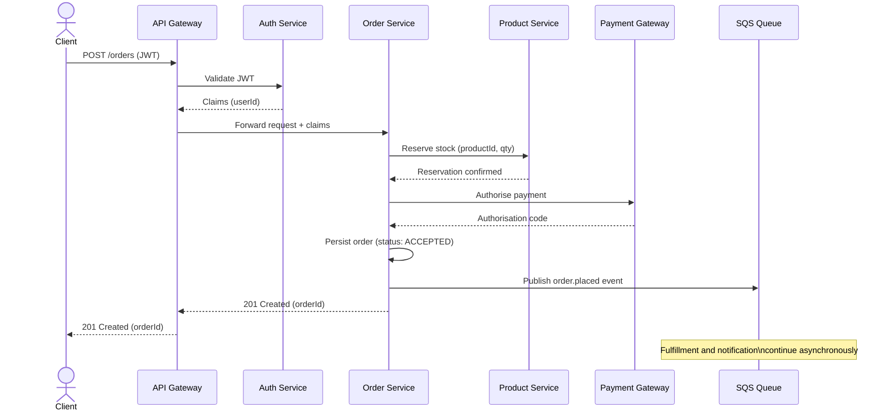
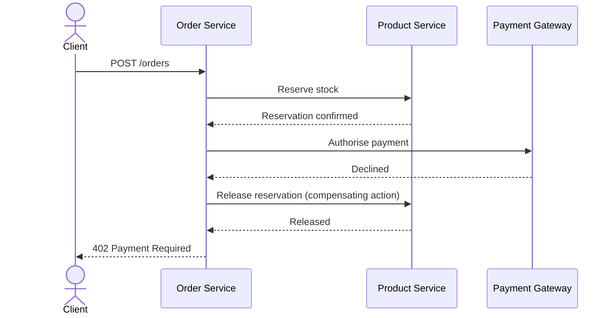
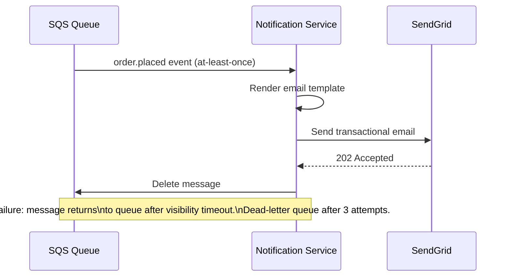

# Runtime View

## Scenario: Place Order

The most critical user journey: a client submits an order, which is validated, paid,
and acknowledged before fulfillment processing continues asynchronously.

## Scenario: Payment Failure

When Stripe declines authorisation, the order is rejected and the stock reservation
is released. The client receives a clear error without any charge.

## Scenario: Notification Delivery

The notification service consumes events from SQS independently of the order flow.
Failures in notification delivery do not affect order processing.

