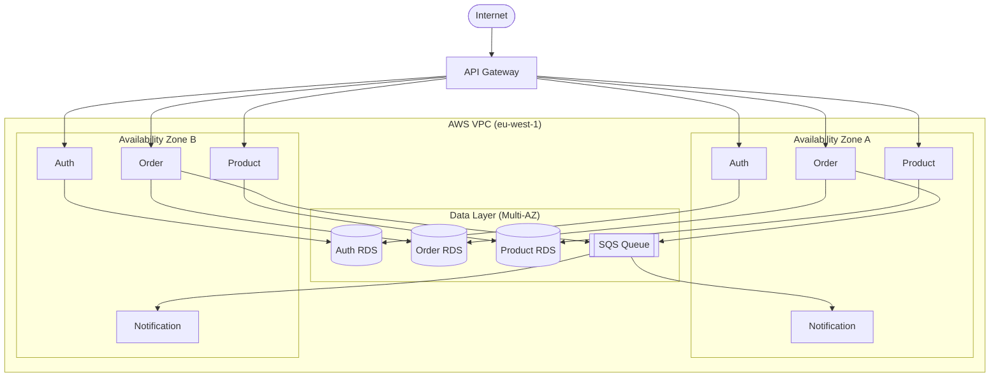

# Deployment View

## Infrastructure Overview

All services are deployed to AWS ECS (Fargate) across two availability zones within a
single AWS region. The API gateway is managed by AWS API Gateway. Each service has its
own RDS PostgreSQL instance. SQS is a regional managed service with no single point of failure.

All services run on ECS Fargate. Each box above represents an ECS task; the two availability
zones provide redundancy.

## Deployment Environments

| Environment | Purpose | Notes |
| --- | --- | --- |
| Development | Local Docker Compose | All services run locally; external services are stubbed |
| Staging | AWS (eu-west-1, single AZ) | Full integration with Stripe test mode and SendGrid sandbox |
| Production | AWS (eu-west-1, multi-AZ) | Live traffic; auto-scaling enabled on Order Service |

## Deployment Process

Each service has an independent CI/CD pipeline:

1. Pull request triggers build, unit tests, and contract tests
2. Merge to `main` builds and pushes a Docker image tagged with the commit SHA
3. ECS rolling deployment updates tasks with zero downtime
4. Health check endpoint (`/health`) must return 200 before old tasks are drained
5. Rollback is triggered automatically if the health check fails within the deployment window
