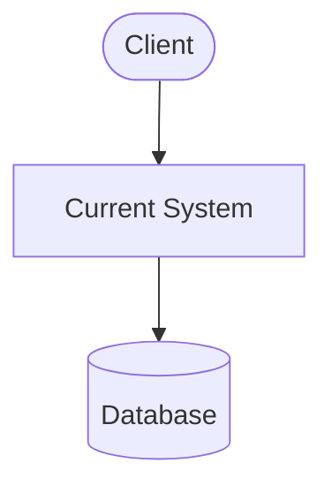

# Current State

Describe the existing system — its architecture, technology stack, and operational context.

## Architecture Overview

Summarise how the current system is structured. A diagram can help orient the reader.

## Pain Points

- **Issue one** — describe the impact on users, operations, or the business
- **Issue two** — describe the impact
- **Issue three** — describe the impact

## Constraints

List any constraints that the proposed solution must respect (regulatory, contractual, existing integrations, etc.).
