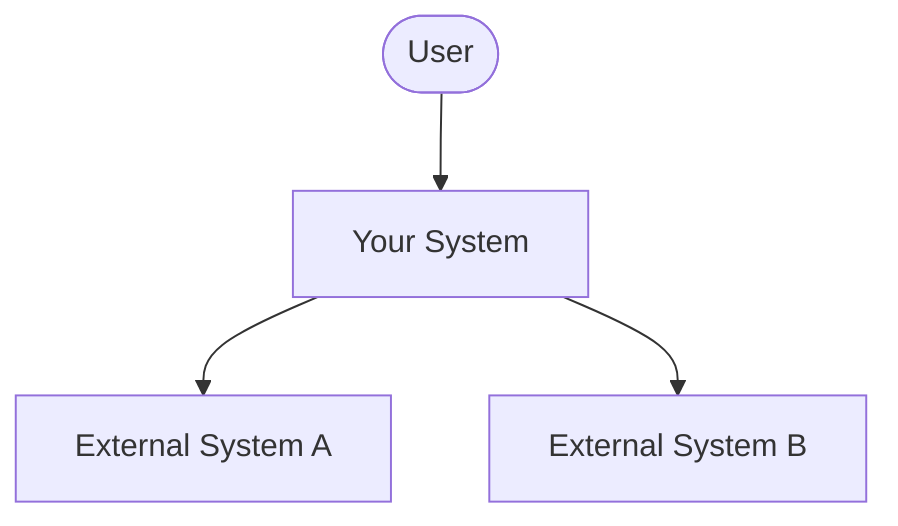

# Context and Scope

<!-- arc42 Section 3 — https://docs.arc42.org/section-3/ -->

## Business Context

<!-- Define the system's environment: the people and external systems that interact with it.
     Use a C4 System Context diagram to show this — https://c4model.com/#SystemContextDiagram
     Focus on who interacts with the system and what they exchange, not how it works inside. -->

| Neighbour | Description | Interface Direction |
| --- | --- | --- |
| User | | inbound |
| External System A | | outbound |
| External System B | | outbound |

## Technical Context

<!-- Describe the technical interfaces: protocols, data formats, and communication channels. -->

| Interface | Protocol / Format | Notes |
| --- | --- | --- |
| | | |
