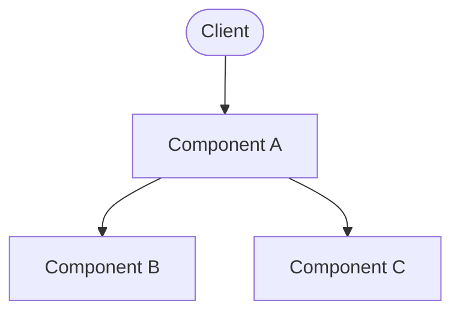

# Proposed Solution

Describe the proposed approach at a high level. Explain the core idea before diving into details.

## Architecture Overview

## Key Design Decisions

| Decision | Choice | Rationale |
| --- | --- | --- |
| Decision one | Option chosen | Why this option was preferred |
| Decision two | Option chosen | Why this option was preferred |

Table: Key design decisions {#tbl:decisions}

Refer to [@tbl:decisions] for a summary of the architectural choices.
