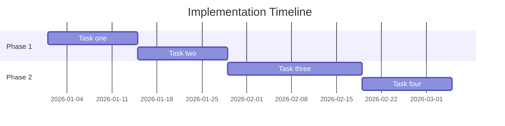

# Implementation Plan

Describe how the solution will be delivered — in what order, in what phases, and with what exit criteria.

## Timeline

## Phase 1 — Foundation

Describe the first phase: what is delivered and why this order makes sense.

**Exit criteria:** Define what "done" means before moving to Phase 2.

## Phase 2 — ...

Describe subsequent phases as needed.

**Exit criteria:** Define what "done" means before moving to the next phase.
