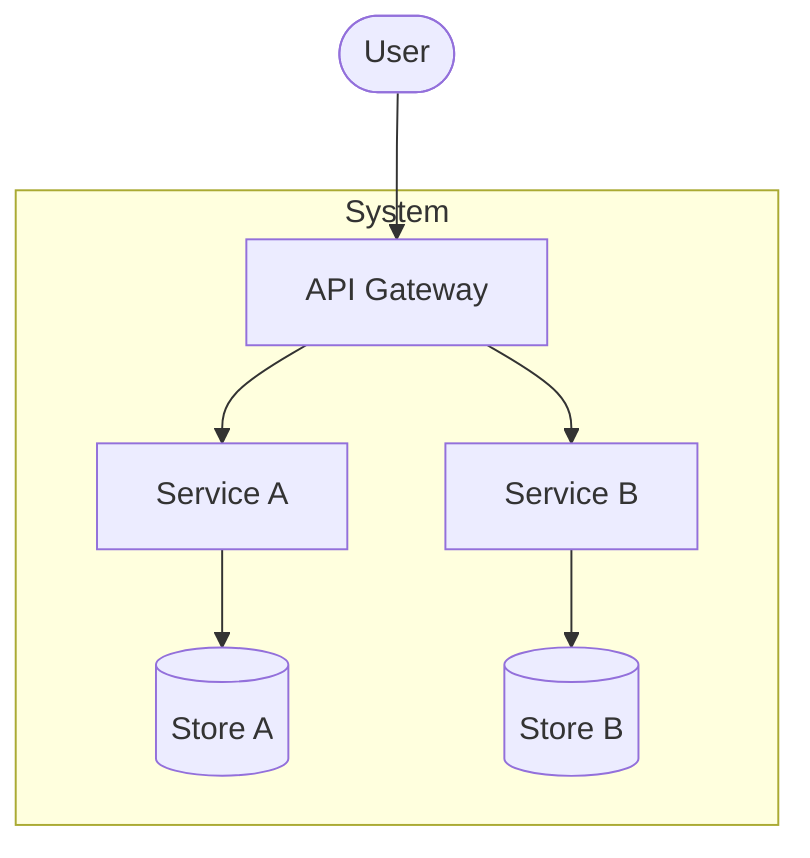

# Building Block View

## Level 1: Container Overview

<!-- Show the high-level decomposition into main building blocks (C4 Container level).
     Each box should be independently deployable or a clearly bounded module. -->

| Building Block | Responsibility |
| --- | --- |
| API Gateway | |
| Service A | |
| Service B | |

## Level 2: [Component Name] Internals

<!-- Zoom into building blocks that require further explanation.
     Duplicate this subsection for each component that needs decomposing. -->

| Component | Responsibility |
| --- | --- |
| | |
