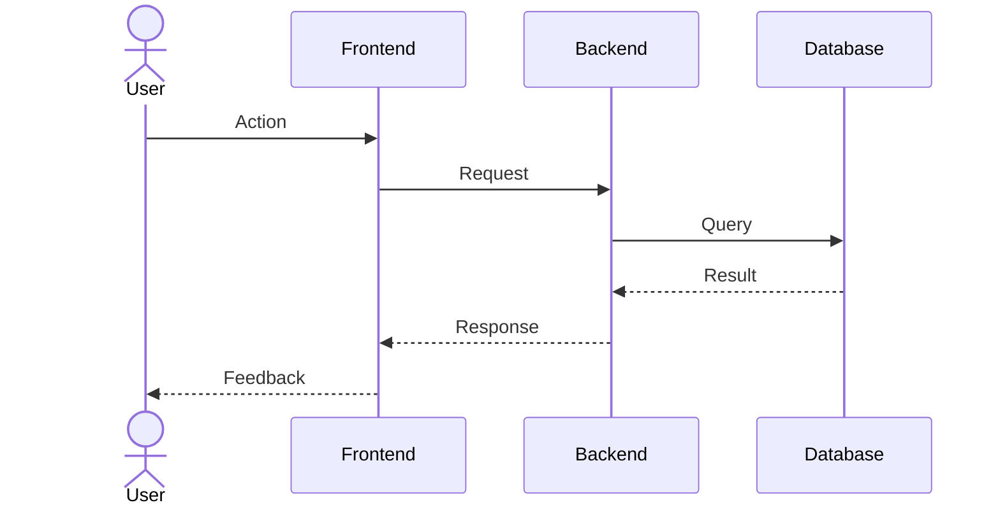

# Runtime View

<!-- arc42 Section 6 — https://docs.arc42.org/section-6/
     Describe the important runtime scenarios: how the building blocks interact
     to fulfil the key use cases. Document both happy paths and failure cases. -->

## Scenario: [Primary Use Case]

<!-- Choose the most important use case — the one most stakeholders will ask about. -->

## Scenario: [Failure / Error Case]

<!-- Document how the system behaves under failure, timeout, or unexpected load. -->
