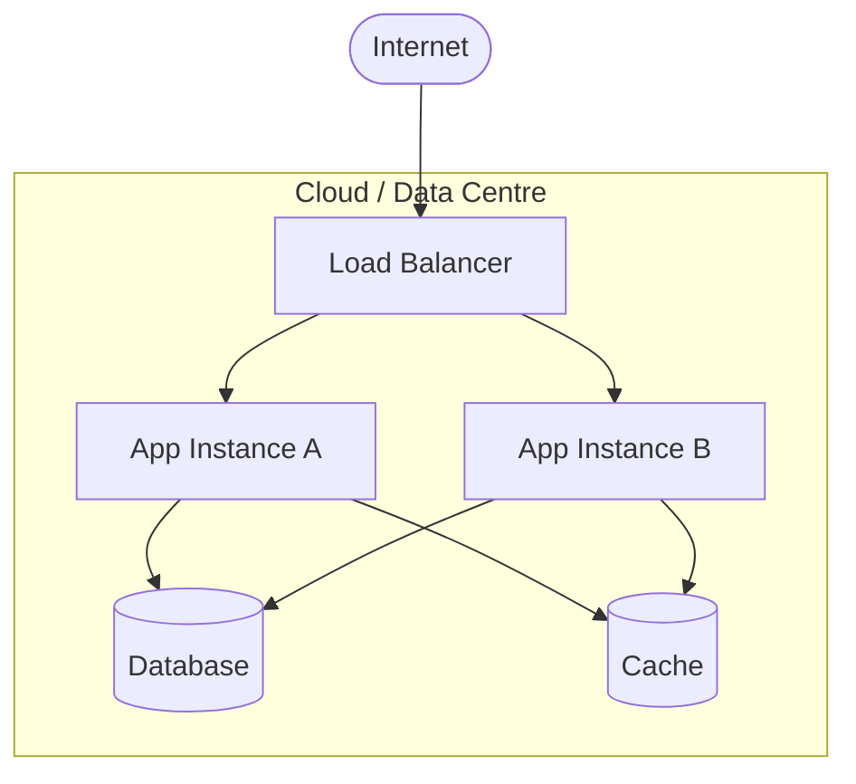

# Deployment View

<!-- arc42 Section 7 — https://docs.arc42.org/section-7/
     Describe the technical infrastructure and how building blocks are mapped to it.
     Use a C4 Deployment diagram to show infrastructure — https://c4model.com/#DeploymentDiagram
     Include the most important environments. -->

## Infrastructure Overview

## Deployment Environments

| Environment | Purpose | Notes |
| --- | --- | --- |
| Development | Local developer environment | |
| Staging | Pre-production testing | |
| Production | Live traffic | |

## Deployment Process

<!-- Describe how a change moves from commit to production:
     CI pipeline steps, approval gates, rollback strategy. -->
